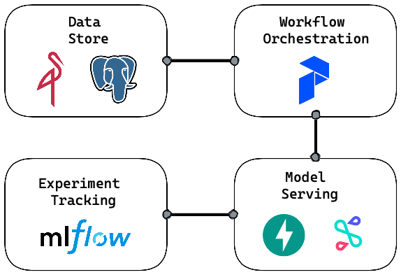

# mlops
Simple modern mlops for individuals

### Requirements for modern mlops
- Free and open source
- Simple to deploy

### Components
- [x] Data Store (Minio / PostgreSQL / Feast?)
- [x] Experiment Tracking (MLFlow)
- [x] Workflow & Dataflow (Prefect)
- [ ] Model Serving (FastAPI? / Seldon?)

### Architecture


### Requirements:
- Docker

### Commands to run 
```
Windows
docker-compose.exe pull
docker-compose.exe up --build

Mac
docker-compose up --build
```

### Limitations
- Question mark on docker-compose for production
- Use docker swarm or k8s instead

### Roadmap
- [ ] Move secrets to .env
- [ ] Feast
- [ ] MLServer
- [ ] Cloud provider, e.g. GCP
- [ ] More complex k8s setup