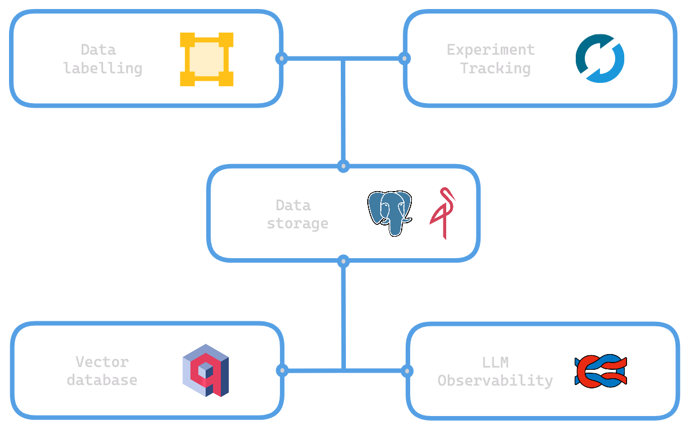

# MLOps
Simple modern open source mlops.

## Design


## Applications
- Data storage (MinIO & PostgreSQL)
- Vector store (Milvus)
- Data labeller (Label Studio)
- Experiment Tracking (MLflow)
- LLM Observability (Langfuse)
- Admin Tools 
    - pgAdmin: PostgreSQL 
    - Attu: Milvus

## Getting started 
This setup requires docker and docker compose. Easiest way to get started is to install docker desktop.

Create a .env file with the following. Values below are only placeholders.
```
POSTGRES_DATABASE=postgres
POSTGRES_HOST=postgres
POSTGRES_PASSWORD=password
POSTGRES_PORT=5432
POSTGRES_USER=postgres

PGADMIN_DEFAULT_EMAIL=admin@pgadmin.com
PGADMIN_DEFAULT_PASSWORD=password

MINIO_ROOT_USER=minio
MINIO_ROOT_PASSWORD=password
```

Run following command
```
docker-compose up -d
```

## Roadmap
- [ ] Minikube / kind setup

## Resources
### Docker
- [PostgreSQL docker documentation](https://hub.docker.com/_/postgres/)
- [MinIO dockerhub](https://hub.docker.com/r/minio/minio/#!)
- [Milvus docker compose](https://milvus.io/docs/install_standalone-docker-compose.md)
- [Label Studio docker compose](https://labelstud.io/tutorials/segment_anything_model#Using-Docker-Compose-recommended)
- [MLflow docker image](https://github.com/mlflow/mlflow/pkgs/container/mlflow)
- [Langfuse repo](https://github.com/langfuse/langfuse)
- [pgAdmin docker documentation](https://www.pgadmin.org/docs/pgadmin4/8.8/container_deployment.html)
- [attu github](https://github.com/zilliztech/attu)
### Kubernetes
TODO

## Troubleshooting
- Insufficient resources
    - Docker compose has been setup with minimum specs for my setup
    - Potential to run into out of memory exceptions on different setups / with newer version.
    - Remove deploy section under each service as a quick workaround
- Latest version may introduce breaking changes
    - Images all currently point at the latest version of each service, which may require additional changes not present yet.

## Clunky aspects
- MLflow: no official image containing psycopg2. Workaround of running `pip install psycopg2` prior to launching server. (Not enough benefits to create custom image)
- postgreSQL: Setting up multiple databases. Mounting init-db.sql to docker-entrypoint-initdb.d folder which is automatically run only if postgres volume is empty.
- MinIO: separate container created to create bucket for MLflow. Left with "dead" container after setup.
- Langfuse: no official image for arm

## List of dependencies
- PostgreSQL: [repo (mirror)](https://github.com/postgres/postgres)
- MinIO: [repo](https://github.com/minio/minio)
- Milvus: [repo](https://github.com/milvus-io/milvus)
- Label Studio: [repo](https://github.com/HumanSignal/label-studio)
- MLflow: [repo](https://github.com/mlflow/mlflow)
- Langfuse: [repo](https://github.com/zilliztech/attu)
- pgAdmin: [repo](https://github.com/pgadmin-org/pgadmin4)
- attu: [repo](https://github.com/zilliztech/attu)
