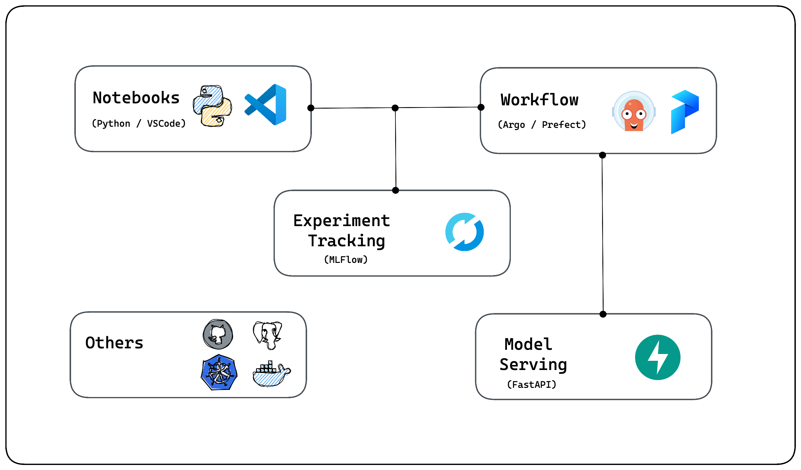

# MLOps
Simple-ish modern mlops for individuals

### Requirements for modern mlops
- Free and open source
- Simple to deploy

### Components
- [X] Notebooks / Analysis (VSCode / Python)
- [x] Data Store (Minio / PostgreSQL) 
- [x] Experiment Tracking (MLFlow) https://mlflow.org/docs/latest/tracking.html#amazon-s3-and-s3-compatible-storage
- [x] Workflow & Dataflow (Prefect / Argo)
- [x] Model Serving (FastAPI)
- [X] Code Repository (Github)

### Architecture


### Run locally
```
docker-compose up --build
```

## Useful resources
- https://mlops.neptune.ai
- https://ml-ops.org

## .env file
```
POSTGRES_DB=
POSTGRES_PASSWORD=
POSTGRES_USER=

PGADMIN_DEFAULT_EMAIL=
PGADMIN_DEFAULT_PASSWORD=

MINIO_ROOT_USER=
MINIO_ROOT_PASSWORD= 

MINIO_ACCESS_KEY=
MLFLOW_DB_TABLE=
```
