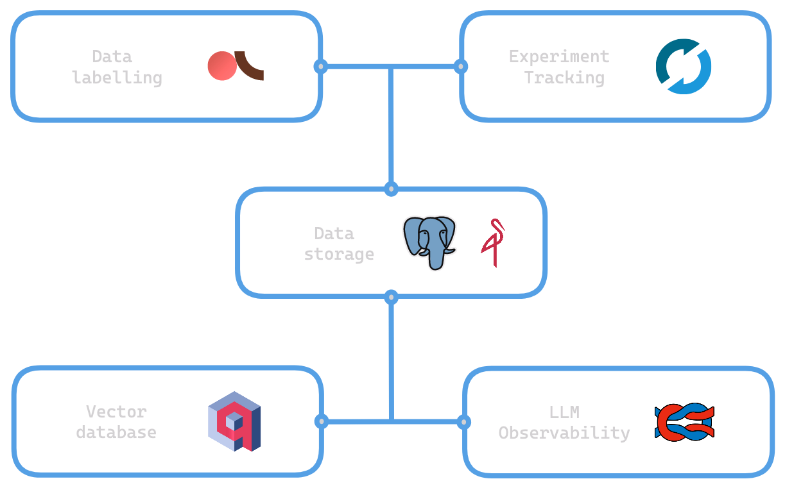

# Open Source MLOps
Simple open source MLOps stack with docker compose.

## Design


## Quickstart
This setup requires docker and docker compose. The easiest way to get started is to install [docker desktop](https://docs.docker.com/desktop/install/mac-install/).

Create a .env file with the following keys. Values below are only placeholders and can be freely changed.
```
POSTGRES_DATABASE=postgres
POSTGRES_HOST=postgres
POSTGRES_PASSWORD=password
POSTGRES_PORT=5432

MINIO_ROOT_USER=minio
MINIO_ROOT_PASSWORD=password
```

Now run the following command:
```
docker-compose up -d
```

Once the applications have started and are ready, you can access them on the following urls:
- MLflow: [http://localhost:5001](http://localhost:5001)
- MinIO: [http://localhost:9001](http://localhost:9001)

## Applications
- [PostgreSQL (SQL)](https://github.com/postgres/postgres)
- [MinIO (object storage)](https://github.com/minio/minio)
- [Qdrant (vector search)](https://github.com/qdrant/qdrant)
- [Argilla (data annotation)](https://github.com/argilla-io/argilla)
- [MLflow (experiment tracking & model registry)](https://github.com/mlflow/mlflow)
- [Langfuse (LLM observability)](https://github.com/langfuse/langfuse)

## Updating images
The following commands will stop the containers, update images if new versions have been published and redeploy containers.
```
docker-compose stop
docker-compose pull
docker-compose up -d
```

## Clunky aspects
- MLflow: no official image containing psycopg2. Workaround of running `pip install psycopg2` prior to launching server. (Not enough benefits to create custom image).
- postgreSQL: Setting up databases per application. Mounting init-db.sql to docker-entrypoint-initdb.d folder which is automatically run only if postgres volume is empty.
